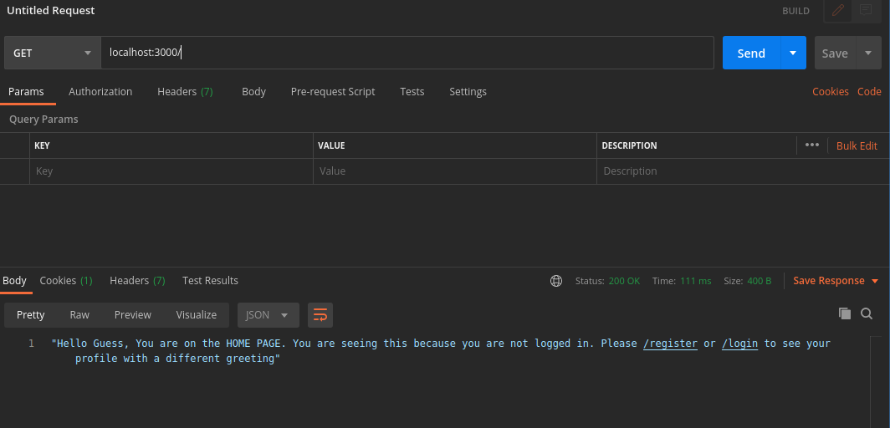
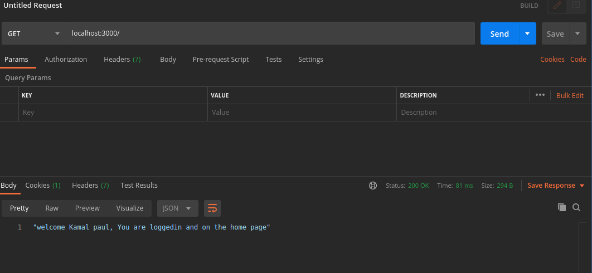

# Nodejs Coding Assessment Test

<br />
<p align="center">
  <a https://mypatricia.co/">
    
  </a>
</p>
Nodejs is used to create API endpoints that allow users do the following;

- Login
- Logout
- Register

Added Implementation/Functionalities

- user persistency
- home page for greeting guest user(visitors that are not registered on the websited)
- profile page(for logged in users)
- test
- permission levels for the different routes(if you visit the registration route, you will not be able to register new visitors until you loggout any loggin user. Same with login route)

### Built With

- [Nodejs](https://nodejs.org/en/)
- [Chai](https://www.chaijs.com/)
- [Mocha](https://mochajs.org/)
- [joi](https://joi.dev/api/)
- [Expressjs](https://expressjs.com)
- [Monogodb](https://www.mongodb.com/)
- [eslint](https://eslint.org/)
- [passport](http://www.passportjs.org/)

<!-- GETTING STARTED -->

## Getting Started

This is an example of how you may give instructions on setting up your project locally.
To get a local copy up and running follow these simple example steps.

### Prerequisites

This is an example of how to list things you need to use the software and how to install them.

- npm
  ```sh
  npm install npm@latest -g
  ```

### Installation

2. Fork the repo
   ```sh
   git clone https://github.com/udofia2/coding-assessment-test
   ```
3. Install NPM packages
   ```sh
   npm install
   ```
3. Environmental setup
   ```sh
   cp sample.env .env
   ```
3. To start development server
   ```sh
   npm run dev
   ```
3. To run test
   ```sh
   npm test
   ```
3. To format the code
   ```sh
    npm run lint:fix
   ```


## Usage

This project can be tested using postman, insomnia etc.
available routes are
* /home (this is the home route for both guess and login users. The view depends on whether the user is logged in or not)

* /register (public route -> available to everyone)

* /logout (protected route -> only available to login users)

* /login (public -> available to everyone)

* /profile (protected)

* /users (displays list of registered users(protected -> Only visible to login users))

While testing the route, Please be mindful to use the right http METHOD. a route that uses a POST method will not work with GET method

Please remember to logout before you try to use the /register and login route. If you are logged in, your won't have access to the /register and /login route


_For more examples, please refer to the [Documentation](https://documenter.getpostman.com/view/7592361/TzJphfHj)_

## Contributing

Contributions are what make the open source community such an amazing place to be learn, inspire, and create. Any contributions you make are **greatly appreciated**.

1. Fork the Project
2. Create your Feature Branch (`git checkout -b feature/AmazingFeature`)
3. Commit your Changes (`git commit -m 'Add some AmazingFeature'`)
4. Push to the Branch (`git push origin feature/AmazingFeature`)
5. Open a Pull Request


## License

Distributed under the MIT License. See `LICENSE` for more information.


## Contact

UDOFIA ABASIODONG - Twitter: [@enalsy2](https://twitter.com/enalsy2) - enalsy22@gmail.com

Project Link: [https://github.com/udofia2/coding-assessment-test](https://github.com/udofia2/coding-assessment-test)


## ScreenShoots






